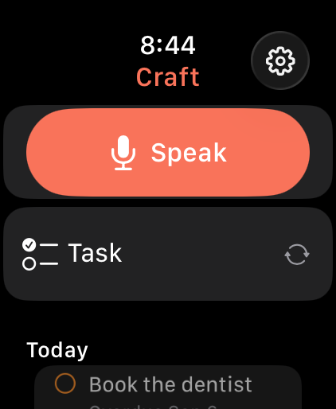
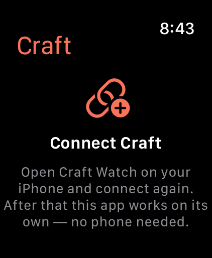
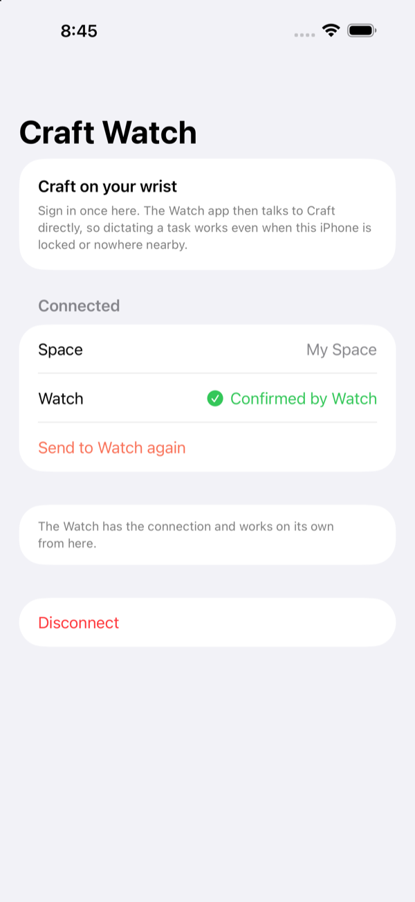
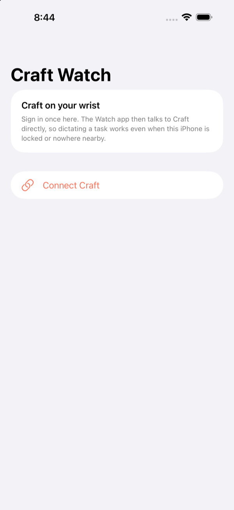

# Craft Watch

A native Apple Watch app for [Craft](https://craft.do): raise your wrist, dictate a task or
note, and it lands in Craft — **with your iPhone locked, or not there at all.**

That last part is the whole reason this exists. The Craft Shortcut approach routes through
Craft's *iPhone* action, so the Watch is only a remote control and the request dies on a
locked phone. This app talks to Craft directly from the Watch.

## Screenshots

| Watch — capture | Watch — first run |
|:---:|:---:|
|  |  |

| iPhone — connected | iPhone — first run |
|:---:|:---:|
|  |  |

Captured from the simulator with `CRAFT_DEMO=1`, so the content is placeholder rather
than a real Craft space.

## How it talks to Craft

Craft has no public REST API. Its only programmable surface is its MCP server, and that
turns out to be a better fit than a REST API would have been:

| | |
|---|---|
| Endpoint | `https://mcp.craft.do/my/mcp` (Streamable HTTP, JSON-RPC 2.0) |
| Auth | OAuth 2.1 — PKCE S256, dynamic client registration, `token_endpoint_auth_method: none` |
| Tools | exactly two: `craft_read` and `craft_write`, each taking one CLI-style `command` string |

Two consequences shaped the design:

1. **No client secret, and refresh tokens are issued.** The Watch can hold the refresh
   token and mint its own access tokens forever, with no phone in the loop. This is what
   makes locked-phone capture work.
2. **Two tools, one string argument each.** No MCP SDK is needed — `URLSession` plus
   `JSONSerialization` covers it in one file, which matters on watchOS.

The commands used are the same ones Craft's own CLI exposes:

```
tasks list --scope active
tasks add --markdown "…" --schedule today
tasks update --id <id> --state done
blocks add --date today --markdown "…" --position end
```

Two things about that last one, both learned the hard way:

- **`blocks add --date` is undocumented but creates the Daily Note if that day has none.**
  The obvious approach — `blocks get --date today` for the page id, then `blocks add --id`
  — fails outright on any day whose note does not exist yet, which is most mornings, and
  silently queued every Daily Note capture.
- **Craft reports command failures as plain `<error>…</error>` text**, with no `isError`
  flag and no JSON. A caller that only checks a JSON `success` field reads a failure as a
  success, so `CraftMCPClient` now rejects that text centrally for reads and writes
  alike.

## Spoken due dates

Say "set appointment for tomorrow at three o'clock" and you get a task titled
*Set appointment — 3:00 PM* scheduled for tomorrow. `Shared/DatePhraseParser.swift` does
this with `NSDataDetector`: on-device, no network, and it already understands spelled-out
times, weekday names and relative days.

**Craft tasks store only a date.** `taskInfo.scheduleDate` has no time component, and a
time passed to `--schedule` is silently dropped (verified against a live space). So the
day goes in `--schedule` and any spoken clock time is appended to the task text, which is
the most that model allows.

Two traps this parser is built around:

- **A missing time resolves to 12:00**, which is indistinguishable from "noon". So
  whether a time was spoken is decided from the matched *words* — clock digits, am/pm,
  o'clock, noon, midnight, or a bare hour after "at" — never from the resolved value.
- **Vague parts of the day are deliberately not times.** "Saturday afternoon" resolves to
  15:00, but recording 3:00 PM would invent precision the speaker never gave, so those
  words stay in the title instead.

Where the detector cannot help, it degrades rather than guesses: "call the bank at 2"
finds no day and schedules today with the words intact; "standup Monday at nine" schedules
Monday and leaves "at nine" in the title. Nothing is lost and nothing is fabricated.

The date is resolved **at capture time, not at send time** — a queued capture that said
"tomorrow" and flushes next week still means the day it was spoken, which is why
`PendingCapture` carries `scheduleDay`.

## Architecture

```
Phone (setup only)                 Watch (does the work)
──────────────────                 ─────────────────────
SetupView                          RootView ── TextFieldLink (dictate)
  └ ASWebAuthenticationSession       ├ TaskRow  (tap = complete)
      OAuth: register → PKCE →       ├ CaptureSheet (complication deep link)
      authorize → token              └ SettingsView
  └ PhoneConnectivity              CraftStore  (@Observable)
      updateApplicationContext  ──▶ WatchConnectivityReceiver
                                   PendingQueue (disk, survives relaunch)
                                   CredentialStore (Keychain, afterFirstUnlock)
                                   CraftMCPClient ──▶ mcp.craft.do
                                   CraftWatchWidget (complication, App Group cache)
```

Deliberate choices worth knowing about:

- **The phone never calls Craft after setup.** It verifies the grant once to read the
  space name, then hands the credentials over and stops. Only one device rotates the
  refresh token, so the two can't invalidate each other.
- **Credentials arrive via `updateApplicationContext`**, which is durable — if the Watch
  is asleep or out of range during setup, WatchConnectivity delivers it later. Delivery is
  only attempted once `isWatchAppInstalled`, and the phone reports success only after the
  Watch sends back an explicit ack: `updateApplicationContext` signals
  `WCErrorCodeWatchAppNotInstalled` *asynchronously in a completion block without
  throwing*, so a non-throwing call is not evidence of delivery.
- **A failed token refresh does not sign you out.** Only an explicit `invalid_grant`
  from the token endpoint clears the stored credentials; every other 4xx is treated as
  recoverable and the refresh token is kept. Token endpoints answer 400 for plenty of
  transient reasons, and an earlier version deleted the grant on any of them — which
  silently returned the Watch to its first-run screen. When the app does sign itself out
  it records why in `SharedDefaults.lastSignOutReason` and the connect prompt shows it.
- **Capture never fails.** Anything that can't be sent goes to `PendingQueue` on disk and
  is retried on next launch or connect. The haptic distinguishes saved from queued.
- **Completion is optimistic.** The row leaves immediately and is restored if Craft
  rejects it.
- **The complication reads a cached count** from the App Group, so it never blocks on the
  network or on auth. Tapping it deep-links straight into dictation.
- **Tool names are resolved from `tools/list`**, so a rename on Craft's side surfaces a
  clear error instead of a silent 404.

## Action button

Apple reserves *direct* Action button registration for workout and dive apps —
`StartWorkoutIntent` and `StartDiveIntent` are the only hooks, so a capture app cannot
appear under Settings ▸ Action Button ▸ App. It gets there through the built-in
**Action ▸ Shortcut** option instead, which runs any App Intent this app exposes.

Three intents live in `Watch/CraftIntents.swift` (in the app target, not an extension —
Apple's guidance for Action button intents):

| Intent | Opens the app | Use |
|---|---|---|
| `CaptureToCraftIntent` | yes | one press → dictation. Assign this to the Action button. |
| `AddCraftTaskIntent(text:)` | no | compose with Shortcuts' *Dictate Text* to save without the app coming forward |
| `AddCraftNoteIntent(text:)` | no | same, into today's Daily Note |

`CraftShortcuts: AppShortcutsProvider` publishes the parameterless one to Siri and
Shortcuts. The two text intents are deliberately left out of it: they take a required
parameter, so they belong in a composed shortcut rather than a bare phrase.

`AppIntents.framework` is linked explicitly in `project.yml`. This is not optional —
`import AppIntents` alone leaves the metadata processor reporting *"Metadata extraction
skipped. No AppIntents.framework dependency found"*, the bundle ships with no
`Metadata.appintents`, and every intent is invisible to Shortcuts. Verify a build with:

```bash
find <built>.app -iname "*appintents*"
```

## Logs

The failure modes here are invisible on a wrist, so the OAuth, MCP, capture and handoff
paths log through `CraftLog` under subsystem `ai.redclay.craftwatch`:

```bash
xcrun devicectl device process launch --device <udid> --console ai.redclay.craftwatch.watchkitapp
```

or Console.app filtered on that subsystem. Categories: `oauth`, `mcp`, `capture`,
`handoff`.

### Recovering a signed-out Watch

The phone holds the refresh token it originally received, but the Watch **rotates** that
token on every refresh, so the phone's copy goes stale as soon as the Watch uses it.
*Send to Watch again* therefore only helps if the Watch never received the credentials in
the first place. If the Watch has signed itself out, tap **Disconnect** and then
**Connect Craft** on the iPhone to mint a fresh grant.

## Build and run

```bash
cd ~/CraftWatch && xcodegen generate && open CraftWatch.xcodeproj
```

`project.xcodeproj` is generated and gitignored — edit `project.yml`, never the project
file. Requires XcodeGen (`brew install xcodegen`).

`project.yml` pins `DEVELOPMENT_TEAM` to the author's Apple Developer team. Change it to
your own before building, or clear it and pick a team in Xcode's Signing & Capabilities.

Targets: `CraftWatch` (iOS companion), `CraftWatch Watch App`, `CraftWatchWidget`.
Bundle IDs live under `ai.redclay.craftwatch`; App Group `group.ai.redclay.craftwatch` is
shared by the Watch app and its widget. Signing is automatic against team `3RPG92BQ9C`.

### First run

1. Run the **CraftWatch** (iOS) scheme on your iPhone, tap **Connect Craft**, approve the
   space in the Craft page that opens.
2. Open **Craft** on the Watch. It picks up the credentials and lists today's tasks.
3. Add the *Craft Tasks* complication to a watch face for one-tap dictation.

### Seeing the UI

The Claude Code live simulator panel does not work on this machine: its helper
(`/Applications/Claude.app/Contents/Helpers/Claude iOS Sim.app`) aborts in
CoreImage/Metal via FBSimulatorControl before it reaches the app, so it crash-loops on
every screenshot. Use simctl instead:

```bash
Scripts/shot.sh [output-dir]     # screenshots every booted simulator
```

`CRAFT_DEMO=1` also works on the iOS app (`SetupModel.seedDemo()`), rendering the
connected setup screen without signing in — which is how the stretched-row bug in the
Connected section was found and fixed.

### Inspecting the UI without a Craft account

```bash
SIMCTL_CHILD_CRAFT_DEMO=1 xcrun simctl launch <sim-udid> ai.redclay.craftwatch.watchkitapp
```

Seeds a plausible connected state (`CraftStore.seedDemo()`, `#if DEBUG` only) so the main
screen renders without a real grant.

## State of things

Verified:

- Both schemes build clean for Debug and Release.
- `TaskListParser` round-trips real `tasks list` output — ids, done state, schedule vs
  deadline, container names, overdue logic, curly quotes and em dashes intact.
- Command quoting round-trips through Craft (tested live against a real space with
  embedded `"` and `'`).
- OAuth chain confirmed live against `mcp.craft.do`: resource metadata → authorization
  server metadata → dynamic client registration returns a usable public `client_id`.
- Watch app launches and renders in the simulator, unconnected and connected.
- The Watch app carries an icon (`CFBundleIconName` and an `AppIcon` entry in
  `Assets.car`), without which watchOS refuses to install on real hardware.
  Both apps carry one. Regenerate with
  `swift Scripts/make-icon.swift <out.png> ios|watchos` — the watchOS glyph is drawn
  smaller so it survives the circular crop.
- WatchConnectivity works end to end against a paired simulator pair: activation
  completes, the counterpart resolves to the paired Watch, and the phone correctly
  reports the Watch app as available. Zero `has not been activated`, zero
  `counterpart app not installed`, zero `pairingIDs no longer match`.

Not yet exercised, because it needs a real Craft sign-in:

- The OAuth round trip through `ASWebAuthenticationSession`.
- Phone → Watch credential handoff (the transport is verified; the payload is not).
- Refresh-token rotation on the Watch.
- Capture and completion against a live space from the Watch.

### Expected console noise

Running the iOS app on a simulator with no paired Watch logs these from `com.apple.wcd`
(the WatchConnectivity daemon, not this app) — they are inherent to having no counterpart
and clear once a Watch is paired:

```
WCSession is not paired
WCSession counterpart app not installed
dropping as pairingIDs no longer match
Application context data is nil
```

`WCSession has not been activated` is *not* in that category. If it reappears, something
is reading `isPaired` / `isWatchAppInstalled` / `applicationContext` before activation
completes — see the comment at the top of `PhoneConnectivity`.

To pair simulators, run the **CraftWatch Watch App** scheme once, or pair them under
Xcode ▸ Window ▸ Devices and Simulators ▸ Simulators.

Not built yet: MCP-backed natural-language commands ("add a follow-up with
Ryan tomorrow"), and background refresh to keep the complication warm without opening
the app.

## License

MIT. See [LICENSE](LICENSE).
